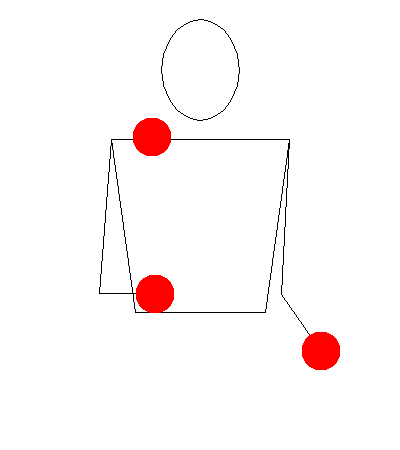
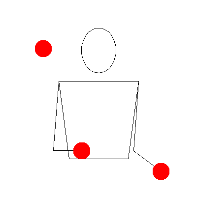
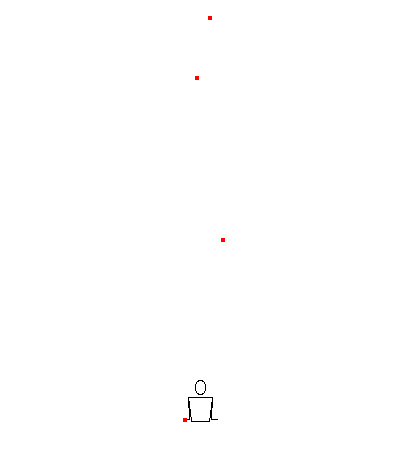

# Juggling patterns

A python script to generate all [siteswaps](https://en.wikipedia.org/wiki/Siteswap) at least somewhat efficiently using [Cython](https://en.wikipedia.org/wiki/Cython).

# Install
1) `pip install .`
2) (Optional) Set environment variable `USE_CYTHON=True` to compile cython `.pyx` file(s) yourself.  
E.g. `USE_CYTHON=True python setup.py build_ext --inplace`

# Usage
```python
from siteswap import (
    all_siteswaps,
    number_of_juggling_patterns,
    random_siteswap
)

all_ss = all_siteswaps(balls=5, period=5, max_throw=7)
n = number_of_juggling_patterns(balls=5, period=5, max_throw=7)
r = random_siteswap(balls=5, period=5, max_throw=7)

print(len(all_ss) == n, r in all_ss)
print(f"n={n}, random_pattern='{r}'")
```

# Tests
`python -m unittest siteswap/tests/*.py`

# Siteswaps

Siteswaps are a notation system to encode juggling patterns. They are read from left to right. The next number in a siteswap pattern indicates to make a throw on this beat that lands `m` beats later. Therefore, higher numbers indicate a higher (or faster) throw, and lower numbers a lower throw. There are two special throws: `0` indicates no ball in hand, and `2` means to hold the ball for one beat in a hand. In a vanilla siteswap, even beats always fall to the same hand, odd beats cross to the other hand.



_`3` or three-ball cascade_

Siteswaps notate patterns that are periodic, therefore the three-ball cascade `333` can be notated as just `3`, or similarly `441441` can be simplified to `441`. This is called the minimal period pattern, which is the only pattern we will explore.

## Ordering



_`441` pattern_

Notice that for all intents and purposes `441` is the same pattern as `414` or `144`, just shifted left or right once (i.e. started earlier or later). Since all patterns we have are periodic, we're going to say that the highest number prevails, and therefore use `441` to describe this pattern.

## Terminology

Period `n` is the (smallest) length of a siteswap pattern. E.g. for `441` `n=3` and for `7045` `n=4`.

The number of balls `b` indicates how many balls are required to juggle a siteswap pattern.



_`f001` – a pattern with a single throw of 15_

When generating siteswaps we might sometimes want to constrain the maximum throw `t`. Humans on earth are after all not that great at throwing heights such as `t=15`.

## Siteswap validity

Not all number combinations create a valid siteswap. First of all, the sum of all numbers in a siteswap `s` must be equal to the number of balls `b` times the period of the pattern `n`:

`s = b * n`

Put another way: the average throw `s / n` must be equal to the number of balls `b`. No fractions allowed.

This is not enough to make a siteswap valid. We are concerned about [_vanilla_ siteswaps](https://en.wikipedia.org/wiki/Siteswap#Vanilla), where the juggler alternates hands. In vanilla siteswapws it is disallowed to throw a ball at the same time another one lands in the same hand, leading to a collision.

A simple collision check can be done by adding `m={0, 1, 2...}` to the `m`th throw of the pattern and calculating the modulus with period `n`. If every number has a distinct modulus, we have a valid pattern. For example `4233` is a valid pattern, since:
```
(4+0) % 4 = 0
(2+1) % 4 = 3
(3+2) % 4 = 1
(3+3) % 4 = 2
```
However, `3432` consists of the same numbers as the previous pattern but is not a valid siteswap:
```
(3+0) % 4 = 3
(4+1) % 4 = 1
(3+2) % 4 = 1
(2+3) % 4 = 1
```
Thus we see that for siteswaps, order matters. In fact, it can be proved that if we have numbers that pass the sum/average test we saw earlier, such as the previous pattern `(3+4+3+2) / 4 = 3`, those numbers can always be re-arranged to produce a valid siteswap. This is similar to [re-arranging rooks on a chessboard](https://www.youtube.com/watch?v=IkJXpcU64-I&t=1539s) or so-called [rook polynomials](https://en.wikipedia.org/wiki/Rook_polynomial).

## Collision check in Python

```python
def balls_dont_collide(sequence: list[int]) -> bool:
    period = len(sequence)
    taken = [False] * period

    for i, x in enumerate(sequence):
        check = (x+i) % period
        if taken[check]:
            return False
        taken[check] = True
    return True
```

# Generating all siteswaps

There is a finite amount of siteswaps for any configuration of number of balls `b`, period `n` and maximum throw `t` if `b<∞` and `n<∞`.

Why?

Let's say `t=∞`, `b=3` and `n=3`. There are only 12 siteswaps with this configuration. For example, consider a valid pattern from this configuration `441`. We could always generate new siteswaps by subtracting the period `n=3` from one of the numbers in the pattern `411` or by adding the period `741`.

However since the period of the pattern `n` didn't change, the number of balls `b` had to change in order to not violate the sum rule. Therefore all we need to do is produce patterns where the sum `s=9` remains the same.

## Naive approach

Let's forget about maximum throw for now.

The (very) naive approach would check every number sequence with period `n` and check if each pattern is a siteswap:
```python
def naive_all_siteswaps1(balls: int, period: int):
    siteswaps = []

    for x in range(10**(period-1), 10**period):
        l = [int(y) for y in str(x)]

        if balls_dont_collide(l):
            siteswaps.append(str(x))

    return siteswaps

print(len(naive_all_siteswaps1(3, 3))) # prints 201
```
This produces `201` numbers. That's far more than the `12` we were promised! That's because there are a lot of patterns that actually have less or more than `b=3` balls because we didn't check that the sum `s=b*n=9`. Let's add a filter:
```python
def naive_all_siteswaps2(balls: int, period: int):
    siteswaps = []

    for x in range(10**(period-1), 10**period):
        l = [int(y) for y in str(x)]

        if sum(l) != balls * period:
            continue

        if balls_dont_collide(l):
            siteswaps.append(str(x))

    return siteswaps

print(len(naive_all_siteswaps2(3, 3))) # prints 30
```
Again, too many patterns. The key is to notice that we are generating same patterns multiple times, e.g. `117`, `171` and `711`. Since we only care about representing the pattern as the one with the highest number, we shouldn't start generating from such a low number.

But how to reason about where to start the process from? We notice that if there's a maximum number `m` inside the pattern, it should be on the leftmost slot. Therefore every number where the maximum number is not on the leftmost slot can be discarded. Since the average throw of the pattern is `s/n = 9/3 = 3`, we can discard every number that is lower than `333`. All of the patterns below `333` would have the maximum number `m` in another slot than the leftmost.

We can also discard `333` since that could be represented minimally by `3`, which is a period `n=1` pattern.

The only way to produce a new pattern with our constraints is if the sum stays the same. Therefore in order to get the next pattern after `333` we need to add `1` to the leftmost number and subtract `1` from another number in order to generate a new pattern. Therefore the lowest starting number should be `423`.
```python
def naive_all_siteswaps3(balls: int, period: int):
    if period == 1:
        return balls

    siteswaps = []

    lowest = int(str(balls+1) + str(balls-1) + ''.join((str(x) for x in [balls] * (period-2))))

    for x in range(lowest, 10**period):
        l = [int(y) for y in str(x)]

        if sum(l) != balls * period:
            continue

        if balls_dont_collide(l):
            siteswaps.append(str(x))

    return siteswaps

print(len(naive_all_siteswaps3(3, 3))) # prints 13
```
Even this is not enough, since we still generate a `450` which is actually a duplicate of `504`. So, we need to sort the siteswap before adding it in:
```python
def sort_sequence(sequence: list[int]) -> list[int]:
    permutations = [sequence[i:] + sequence[:i] for i in range(len(sequence))]
    return max(permutations)

def naive_all_siteswaps4(balls: int, period: int):
    siteswaps = []

    lowest = int(str(balls+1) + str(balls-1) + ''.join((str(x) for x in [balls] * (period-2))))

    for x in range(lowest, 10**period):
        l = [int(y) for y in str(x)]

        if sum(l) != balls * period:
            continue

        if balls_dont_collide(l):
            sorted_seq = sort_sequence(l)
            if sorted_seq == l:
                siteswaps.append(str(x))

    return siteswaps

print(len(naive_all_siteswaps4(3, 3))) # prints 12
```
Finally the correct answer for this configuration! Are we done, then?

No, there are still problems. We are not checking for periodicity, and thus for example `naive_all_siteswaps(2, 4)` produces the pattern `4040` which is actually the same as the minimal periodic pattern `40`. Let's add another check:
```python
# amazing algorithm
# https://stackoverflow.com/a/29489919
def substring_is_periodic(s: str) -> bool:
    if len(s) == 1:
        return False
    return (s+s).find(s, 1, -1) != -1

def naive_all_siteswaps5(balls: int, period: int):
    siteswaps = []

    lowest = int(str(balls+1) + str(balls-1) + ''.join((str(x) for x in [balls] * (period-2))))

    for x in range(lowest, 10**period):
        l = [int(y) for y in str(x)]

        if sum(l) != balls * period:
            continue

        if (balls_dont_collide(l) and
            sort_sequence(l) == l and not
            substring_is_periodic(str(x))):
            # add siteswap
            siteswaps.append(str(x))

    return siteswaps

print(len(naive_all_siteswaps5(2, 4))) # prints 15
```
There's a lot of remaining problems:

1) Maximum throw `t` is not accounted for. The way we set up our maximum range in the for-loop means that we can't have throws higher than `t=9`.
2) Our algorithm does not account for any erroneous input (`b<1`, `n<1` or `t<b`)
3) Our algorithm does not work for `n=1`
4) As we are going through almost half the possible numbers with period `n`, the algorithm becomes super slow with higher periods:
```python
In [186]: %timeit naive_all_siteswaps5(7, 7)
2.02 s ± 15.3 ms per loop (mean ± std. dev. of 7 runs, 1 loop each)
```
